# Enterprise Credit Risk Scoring & ECL Provisioning System

> **End-to-end Machine Learning pipeline** dự đoán xác suất vỡ nợ (Probability of Default), tính toán Expected Credit Loss theo **IFRS 9**, xây dựng dashboard phân tích rủi ro, API scoring và các báo cáo governance cho danh mục **307,511** hồ sơ vay tiêu dùng trên bộ dữ liệu Home Credit Default Risk.

[](https://python.org)
[](https://lightgbm.readthedocs.io)
[](models/model_metrics.json)
[](https://streamlit.io)
[](https://mlflow.org)
[](https://fastapi.tiangolo.com)

---

## Dashboard Preview

<p align="center">
  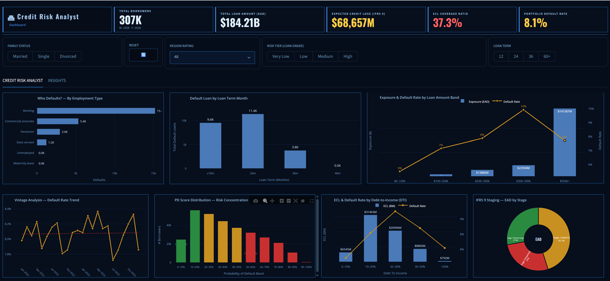
</p>

> Dashboard tương tác với Dark Theme, filter động, KPI phản hồi theo filter và nhiều biểu đồ phân tích rủi ro tín dụng, ECL, PD distribution, vintage và IFRS 9 staging.

---

## Tóm Tắt Điều Hành

| Hạng mục | Kết quả hiện tại |
|---|---|
| Bài toán chính | Binary Classification dự đoán `TARGET` (PD) và tính ECL theo IFRS 9 |
| Bài toán phụ | LGD/EAD modeling, business ROI threshold, SHAP explainability, time-series/scenario analytics |
| Dataset | Home Credit Default Risk - 307,511 hồ sơ train, 48,744 hồ sơ test, 6 bảng quan hệ |
| Feature set | 164 feature sau feature engineering; WoE/IV screening xác định 52 signal chính |
| Benchmark model | 5 thuật toán: CatBoost, LightGBM, XGBoost, Logistic Regression, RandomForest |
| Kết quả PD | OOF AUC 0.7837, Gini 0.5673, KS 0.4255, Brier calibrated 0.0626 |
| IFRS 9 | Stage 1/2/3, lifetime PD, macro overlay, ECL theo PD x LGD x EAD |
| Portfolio ECL | Total EAD ~184.20B, Total ECL ~68.65B, coverage ~37.3% |
| Serving | FastAPI `/score`, `/score/batch`, `/health`, `/model/info` |
| Dashboard | Streamlit dashboard + Power BI-style dashboard preview |
| Kiểm thử | `unittest` smoke tests cho LGD contract và API import |
| Phạm vi hoàn thiện | Hoàn thiện pipeline phân tích, mô hình, dashboard và API ở mức prototype định hướng production; các hạng mục CI/CD, monitoring, fairness và reject inference thuộc phạm vi mở rộng |

---

## Mục Lục

1. [Tổng Quan Dự Án](#tổng-quan-dự-án)
2. [Business Value & ROI](#business-value--roi)
3. [Model Performance](#model-performance)
4. [IFRS 9 & Basel II Framework](#ifrs-9--basel-ii-framework)
5. [Pipeline & Workflow](#pipeline--workflow)
6. [Time Series & Scenario Analytics](#time-series--scenario-analytics)
7. [MLOps & API Serving](#mlops--api-serving)
8. [Model Interpretability](#model-interpretability)
9. [Interactive Dashboard](#interactive-dashboard)
10. [Enterprise Data Warehouse & SQL Use Cases](#enterprise-data-warehouse--sql-use-cases)
11. [Tech Stack](#tech-stack)
12. [Cách Chạy Dự Án](#cách-chạy-dự-án)
13. [Cấu Trúc Thư Mục](#cấu-trúc-thư-mục)

---

## Tổng Quan Dự Án

| Hạng mục | Chi tiết |
|---|---|
| Bài toán | Dự đoán xác suất vỡ nợ của khách hàng vay tiêu dùng và chuyển đổi sang quyết định rủi ro có thể hành động |
| Target variable | `TARGET` (1 = vỡ nợ, 0 = trả đúng hạn) |
| Primary metric | AUC-ROC, phù hợp với credit scoring trên dữ liệu mất cân bằng |
| Secondary metrics | KS Statistic, Gini Coefficient, Brier Score, Recall, F1, Specificity |
| Data size | ~307,511 hồ sơ; 6 bảng quan hệ; 164+ features sau feature engineering |
| Dataset | [Home Credit Default Risk - Kaggle](https://www.kaggle.com/c/home-credit-default-risk) |
| Mục tiêu AUC | >= 0.77; kết quả hiện tại đạt ~0.784 |
| Target role | Data Analyst / Data Scientist - Banking, Risk Analytics, Fintech |

### Các nâng cấp Enterprise đã có

| # | Nâng cấp | Ý nghĩa |
|---|---|---|
| 1 | WoE/IV Feature Screening | Lọc biến theo chuẩn scorecard/Basel-style, xác định 52 tín hiệu chính từ 164 feature |
| 2 | Multi-Model Benchmark | So sánh 5 thuật toán gồm CatBoost, LightGBM, XGBoost, Logistic Regression và RandomForest |
| 3 | Probability Calibration | Isotonic Regression trên OOF predictions để giảm sai lệch xác suất |
| 4 | IFRS 9 Staging | Stage 1/2/3, 12-month PD, lifetime PD và macro overlay |
| 5 | Dynamic LGD/EAD | Tính tổn thất và dư nợ chịu rủi ro theo đặc điểm khoản vay thay vì chỉ dùng giả định cố định |
| 6 | Business ROI Optimizer | Tối ưu threshold theo lợi nhuận kỳ vọng và risk appetite |
| 7 | SHAP Explainability | Giải thích global/local cho underwriting, governance và audit |
| 8 | MLOps Tracking | MLflow, metrics, model artifacts, PSI/CSI monitoring concept |
| 9 | FastAPI Scoring API | Endpoint scoring đơn lẻ và batch cho inference |
| 10 | BI Dashboard | Streamlit dashboard và bộ hình Power BI-style cho phân tích nghiệp vụ |

---

## Business Value & ROI

Phần ROI chuyển đổi xác suất vỡ nợ thành các quyết định nghiệp vụ: phê duyệt, từ chối, review thủ công, thu hồi nợ sớm và trích lập dự phòng.

```text
Net Profit = Revenue từ khách hàng tốt
           - Credit Loss từ hồ sơ vỡ nợ
           - Opportunity Cost từ khách hàng tốt bị từ chối
```

### Kết quả Threshold Optimization

| Chỉ tiêu | Ý nghĩa |
|---|---|
| Net Profit Projected | Kịch bản business report ước tính khoảng 1.8B |
| Approval Rate | Khoảng 86.1%, giữ được phần lớn khách hàng tốt |
| Threshold strategy | Không dùng mặc định 0.5, mà tối ưu theo trade-off lợi nhuận - rủi ro |
| Business action | Auto-approve nhóm rủi ro thấp, manual review nhóm trung bình, auto-reject/early collection nhóm rủi ro cao |

<p align="center">
  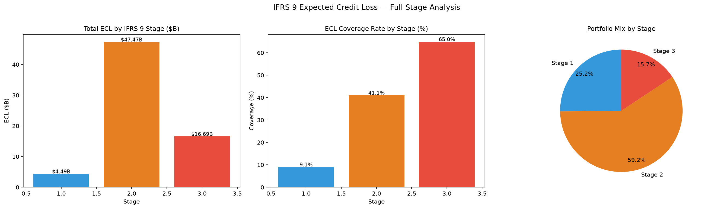
</p>

---

## Model Performance

Báo cáo hiệu năng bao gồm đánh giá classification cho PD và đánh giá LGD/EAD phục vụ chuyển đổi sang ECL theo IFRS 9.

### 1. PD Classification Metrics

Nguồn số liệu chính: `models/model_metrics.json`.

| Metric | Giá trị |
|---|---:|
| Baseline AUC | 0.7400 |
| OOF AUC | **0.7837** |
| Gini Coefficient | **0.5673** |
| KS Statistic | **0.4255** |
| Brier raw | 0.1766 |
| Brier calibrated | **0.0626** |
| PSI score | **0.0045** |
| Optimal threshold | 0.4806 |

Fold AUC ghi nhận dao động trong khoảng 0.7803-0.7880:

```text
Fold 1: 0.7814
Fold 2: 0.7880
Fold 3: 0.7813
Fold 4: 0.7876
Fold 5: 0.7803
```

### 2. Benchmark 5 Thuật Toán

Nguồn số liệu: `reports/model_comparison_leaderboard.csv`.

| Rank | Model | OOF AUC | CV AUC | Recall | F1 | Gini | KS | Brier |
|---:|---|---:|---|---|---|---:|---:|---:|
| 1 | CatBoost | **0.7834** | 0.7835 +/- 0.0039 | 0.7194 +/- 0.0280 | 0.2862 +/- 0.0077 | 0.5669 | 42.65 | 0.1781 |
| 2 | LightGBM | 0.7830 | 0.7831 +/- 0.0036 | 0.7225 +/- 0.0206 | 0.2842 +/- 0.0032 | 0.5660 | 42.56 | 0.1766 |
| 3 | XGBoost | 0.7747 | 0.7747 +/- 0.0036 | 0.7092 +/- 0.0197 | 0.2805 +/- 0.0068 | 0.5494 | 41.29 | 0.1469 |
| 4 | Logistic Regression | 0.7675 | 0.7675 +/- 0.0039 | 0.7055 +/- 0.0247 | 0.2749 +/- 0.0086 | 0.5349 | 40.21 | 0.1958 |
| 5 | RandomForest | 0.7598 | 0.7598 +/- 0.0024 | 0.7123 +/- 0.0147 | 0.2656 +/- 0.0021 | 0.5195 | 39.02 | 0.1817 |

**Logistic Regression baseline:** Source code có Logistic Regression trong `src/modeling.py` dưới dạng baseline pipeline gồm median imputation, standard scaling và class-balanced logistic classifier. Benchmark hiện bao gồm đủ **5 thuật toán**.

**Trạng thái champion/artifact:** bảng benchmark ghi nhận CatBoost có OOF AUC cao nhất, trong khi repo vẫn có cả `model_fold1-5.pkl`, `best_production_model.pkl` và legacy `lgbm_fold1-5.pkl`. Trước khi triển khai production, cần chốt champion registry để README, API và model artifacts đồng bộ theo cùng một phiên bản.

<p align="center">
  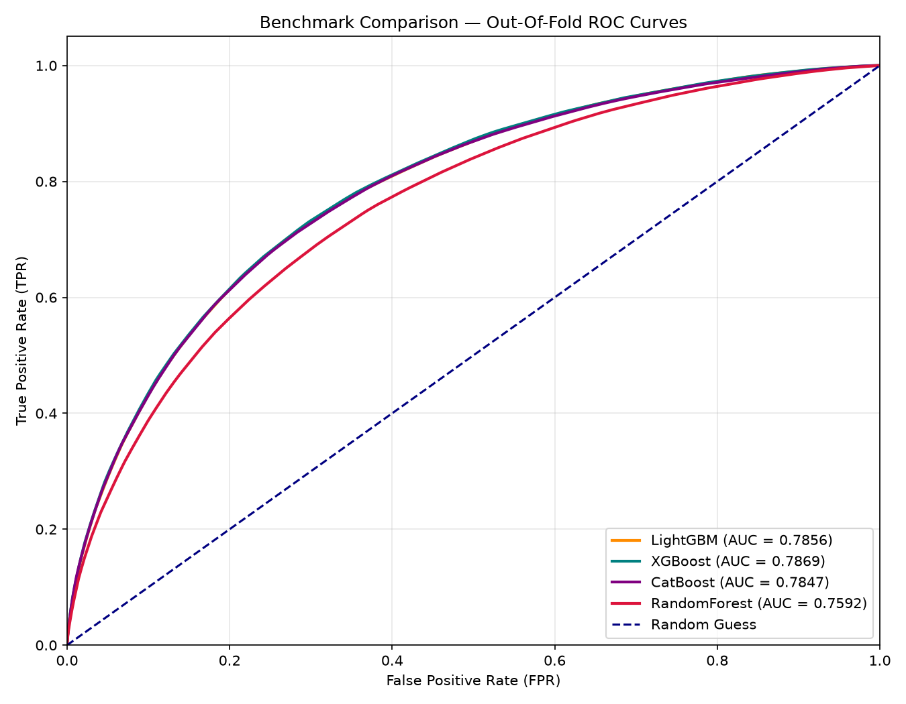
</p>

### 3. Calibration

Isotonic calibration được fit trên OOF predictions để hạn chế leakage. Kết quả Brier Score giảm từ khoảng 0.1766 xuống 0.0626, giúp xác suất PD có ý nghĩa thực tế hơn khi đưa vào ECL và decision threshold.

<p align="center">
  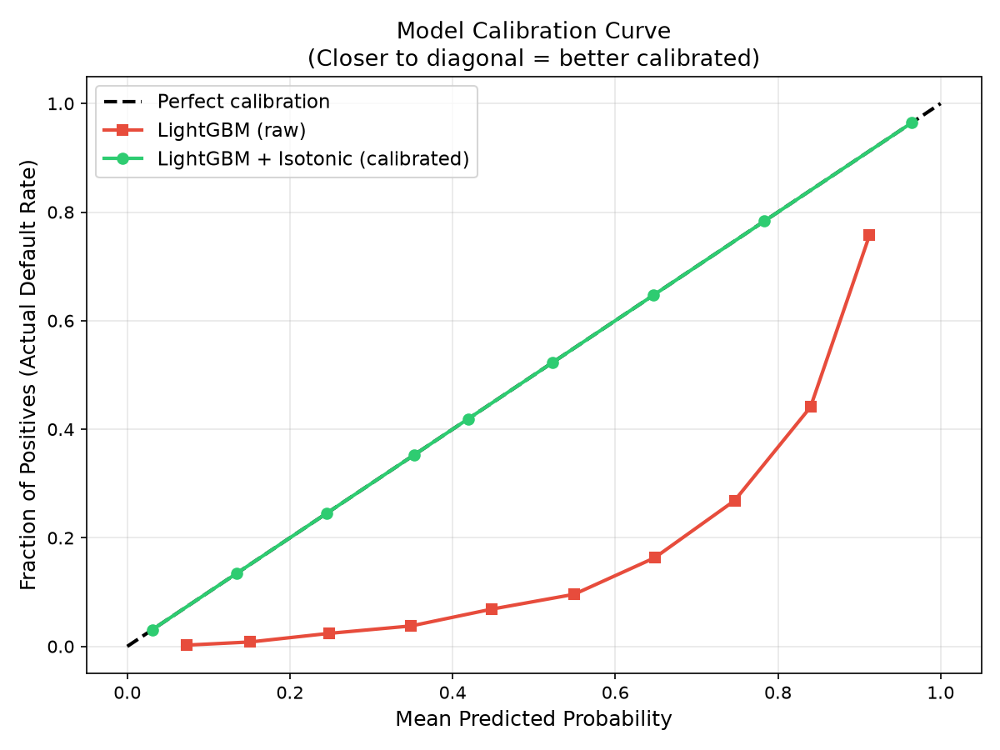
</p>

### 4. Confusion Matrix

<p align="center">
  
  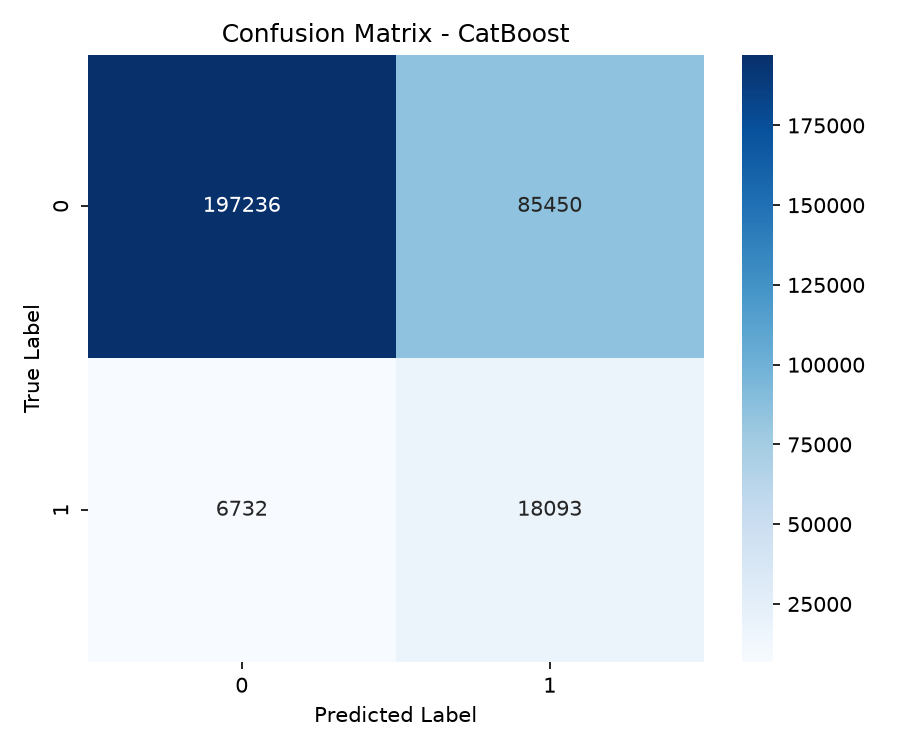
</p>

### 5. LGD Regression

Nguồn số liệu: `reports/lgd_regression_metrics.txt`.

| Metric | LightGBM Regressor | Ridge Regression |
|---|---:|---:|
| MAE | 0.0400 +/- 0.0003 | 0.0402 +/- 0.0003 |
| MSE | 0.0025 +/- 0.0000 | 0.0025 +/- 0.0000 |
| RMSE | 0.0501 +/- 0.0004 | 0.0504 +/- 0.0004 |
| R2 | 0.0134 +/- 0.0060 | -0.0017 +/- 0.0039 |

R2 của mô hình LGD ở mức thấp do bộ dữ liệu Home Credit không cung cấp nhãn LGD thực tế. Repo mô phỏng `ACTUAL_LGD` theo logic Basel/segment và noise để minh họa workflow LGD; trong triển khai ngân hàng, biến mục tiêu này cần được thay bằng dữ liệu recovery/loss lịch sử.

<p align="center">
  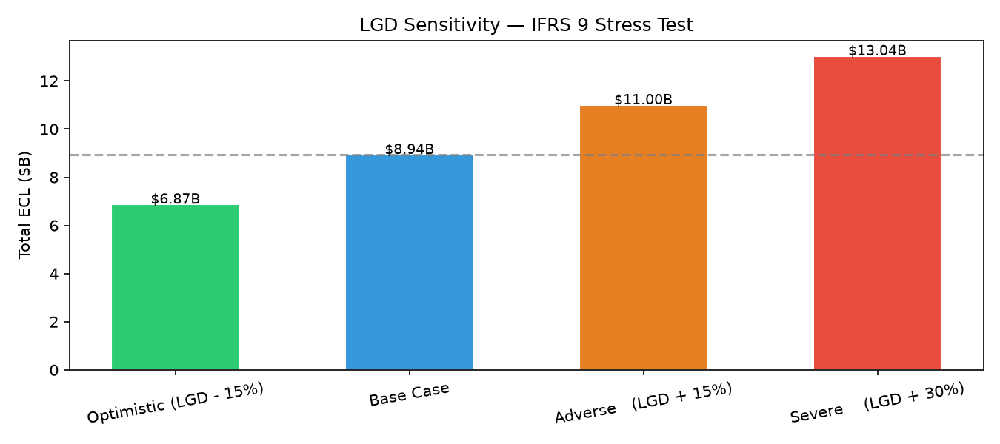
</p>

### 6. Giải thích thuật toán Champion

LightGBM và CatBoost là hai mô hình có hiệu năng dẫn đầu trong benchmark. LightGBM được đưa vào phân tích triển khai do tốc độ huấn luyện, footprint bộ nhớ và khả năng xử lý dữ liệu tabular/sparse sau feature engineering.

| Cơ chế | Ý nghĩa trong credit risk |
|---|---|
| Gradient Boosting Decision Trees | Mỗi cây mới tối ưu phần sai số còn lại của các cây trước, hỗ trợ mô hình hóa quan hệ phi tuyến trong hồ sơ tín dụng |
| Leaf-wise growth | Chia tiếp lá có loss lớn nhất, cải thiện AUC nhanh hơn level-wise tree trong nhiều bài toán tabular |
| GOSS | Tập trung nhiều hơn vào các quan sát khó dự đoán, hữu ích với default class hiếm |
| EFB | Gộp các feature thưa/loại trừ nhau, giảm chi phí bộ nhớ khi có nhiều biến sau feature engineering |
| Class imbalance handling | Kết hợp class weight/threshold tuning để ưu tiên phát hiện default thay vì chỉ tối đa accuracy |

Trong benchmark, Logistic Regression đóng vai trò baseline tuyến tính; RandomForest đại diện nhóm bagging; XGBoost, CatBoost và LightGBM đại diện nhóm gradient boosting cho dữ liệu tabular.

---

## IFRS 9 & Basel II Framework

### Công thức ECL

```text
ECL = PD x LGD x EAD
```

| Thành phần | Cách triển khai |
|---|---|
| PD | Calibrated probability từ mô hình classification |
| LGD | Segment-based / model-assisted LGD theo đặc điểm khoản vay |
| EAD | Exposure at Default dựa trên AMT_CREDIT và credit conversion logic |
| Stage | Stage 1/2/3 theo mức rủi ro và lifetime PD |
| Macro Overlay | Điều chỉnh PD/ECL theo optimistic, base, adverse, severe scenarios |

### IFRS 9 Stage Summary

Nguồn số liệu: `reports/ifrs9_stage_summary.csv`.

| Stage | Count | Total EAD | Total ECL | Avg PD 12M | Avg Lifetime PD | Avg LGD | Coverage |
|---:|---:|---:|---:|---:|---:|---:|---:|
| 1 | 77,378 | 49.23B | 4.49B | 13.98% | 23.92% | 65.00% | 9.09% |
| 2 | 181,947 | 109.29B | 47.47B | 45.12% | 63.22% | 65.00% | 41.10% |
| 3 | 48,186 | 25.68B | 16.69B | 72.61% | 83.03% | 65.00% | 65.00% |
| **Tổng** | **307,511** | **184.20B** | **68.65B** |  |  |  | **37.27%** |

### Macroeconomic Overlay

| Kịch bản | Vai trò |
|---|---|
| Optimistic | Kiểm tra tác động khi môi trường kinh tế thuận lợi hơn kịch bản cơ sở |
| Base | Kịch bản trọng tâm để báo cáo quản trị |
| Adverse | Kịch bản suy giảm để stress risk appetite |
| Severe | Kịch bản căng thẳng để tính capital buffer và provisioning buffer |

<p align="center">
  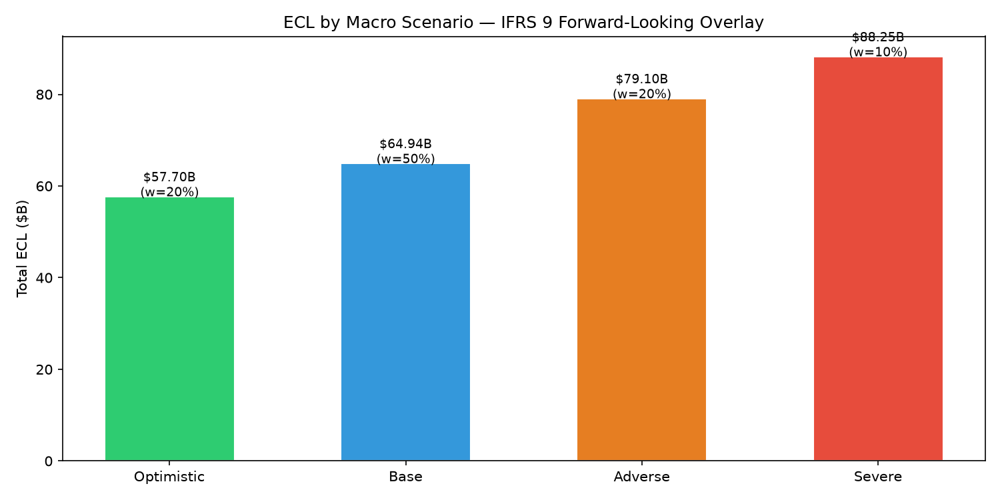
</p>

---

## Pipeline & Workflow

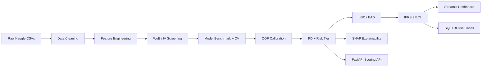

### 8 bước chính

| Bước | Module | Output | Ý nghĩa |
|---:|---|---|---|
| 1 | `src/data_cleaning.py` | cleaned parquet files | Làm sạch dữ liệu, xử lý missing/anomaly/outlier |
| 2 | `src/feature_engineering.py` | `data/train_features.parquet` | Tạo 164 feature từ application, bureau, previous app, installment, POS, credit card |
| 3 | `src/woe_iv_scorecard.py` | `reports/iv_ranking.csv` | Basel-style WoE/IV screening, xác định biến có sức dự báo |
| 4 | `src/optuna_tuning.py` | best params | Bayesian hyperparameter optimization bằng Optuna |
| 5 | `src/modeling.py` | model artifacts, OOF predictions | Huấn luyện/benchmark 5 thuật toán, calibration, risk tier |
| 6 | `src/lgd_ead_model.py` | LGD/EAD columns | Ước tính loss severity và exposure phục vụ ECL |
| 7 | `src/ifrs9_ecl_engine.py` | IFRS 9 outputs | Stage 1/2/3, lifetime PD, macro overlay, ECL |
| 8 | `src/shap_analysis.py` | SHAP charts | Explainability cho governance và underwriting |

### Chi tiết workflow và business insight

**Bước 1 - Data Cleaning:** xử lý missing values, anomaly `DAYS_EMPLOYED = 365243`, outlier thu nhập và chuẩn hóa dữ liệu sang parquet để giảm chi phí load.

**Bước 2 - Feature Engineering:** tổng hợp dữ liệu từ application, bureau, previous application, installments, POS và credit card. Các feature như debt-to-income, credit-to-income, employment length, bureau risk composite giúp mô hình nhìn được cả năng lực trả nợ lẫn lịch sử tín dụng.

**Bước 3 - Basel-style Screening:** dùng WoE/IV để phân loại sức dự báo của biến. Nhóm `EXT_SOURCE_*`, `CREDIT_TERM`, lịch sử bureau và employment là các tín hiệu có giá trị nhất.

**Bước 4 - Hyperparameter Optimization:** Optuna TPE sampler được sử dụng để tìm cấu hình tham số cho boosting model, giảm phụ thuộc vào trial thủ công.

**Bước 5 - Final Modeling & Calibration:** huấn luyện cross-validation, lưu OOF prediction, so sánh 5 thuật toán và fit Isotonic Regression trên OOF để chống leakage.

**Bước 6 - LGD/EAD & IFRS 9:** chuyển PD thành ECL qua PD x LGD x EAD, phân Stage 1/2/3 và chạy macro overlay.

**Bước 7 - Business ROI:** thay vì threshold mặc định, hệ thống tối ưu ngưỡng theo lợi nhuận/rủi ro để hỗ trợ auto-approve, manual-review và auto-reject.

**Bước 8 - Explainability & Governance:** SHAP global/local giải thích lý do risk score, phục vụ underwriter, audit và model risk management.

### Feature Screening Insight

Top IV predictors hiện tại:

| Feature | IV | Strength |
|---|---:|---|
| EXT_SOURCE_3 | 0.3137 | Strong |
| EXT_SOURCE_2 | 0.3062 | Strong |
| EXT_SOURCE_1 | 0.1359 | Medium |
| CREDIT_TERM | 0.1268 | Medium |
| bureau_days_credit_mean | 0.1150 | Medium |
| DAYS_EMPLOYED | 0.1071 | Medium |

<p align="center">
  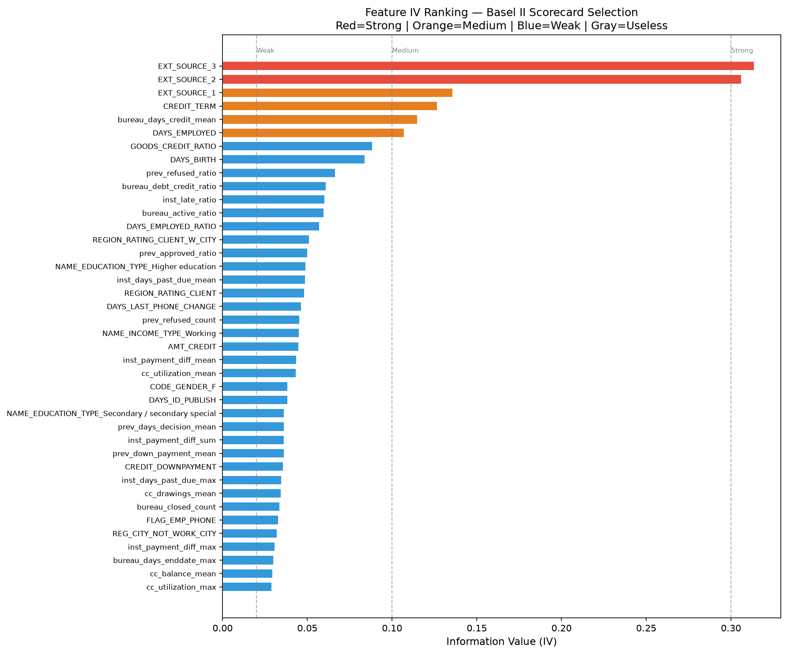
</p>

---

## Time Series & Scenario Analytics

Repo **có phần time-series/scenario analytics** trong `src/time_series_engine.py` và dashboard đã có các góc nhìn liên quan như vintage trend, cohort default, migration matrix, ECL projection và intraday risk simulation.

### Đã có trong source

| Function | Vai trò |
|---|---|
| `derive_application_date` | Tạo application date để phân tích theo thời gian |
| `build_vintage_data` | Phân tích vintage/cohort theo tháng |
| `build_migration_matrix` | Theo dõi chuyển dịch risk tier |
| `build_ecl_projection` | Dự phóng ECL theo horizon |
| `build_cohort_default` | Default rate theo cohort |
| `build_intraday_risk` | Mô phỏng rủi ro trong ngày cho dashboard |

### Phạm vi Time Series

Phần time-series hiện phục vụ **scenario analytics** và trực quan hóa dashboard, chưa phải time-series forecasting đầy đủ vì dataset Home Credit không có lịch sử performance/default theo tháng. Source đánh dấu chất lượng ngày là `proxy`, tức ngày được suy luận/mô phỏng để phục vụ phân tích. Để mở rộng thành forecasting, cần dữ liệu snapshot theo tháng, delinquency history, payment performance và mô hình như survival analysis, hazard model hoặc roll-rate Markov chain.

---

## MLOps & API Serving

### MLflow Tracking

```bash
mlflow ui --backend-store-uri sqlite:///mlflow.db
# http://localhost:5000
```

Metrics được track gồm AUC, Gini, KS, Brier, calibration, PSI và các artifact liên quan. Các hạng mục cần bổ sung cho production gồm CI/CD, model registry policy và approval workflow.

### FastAPI Scoring API

```http
GET  /health
GET  /model/info
POST /score
POST /score/batch
```

Các cập nhật trong source:

| Cải thiện | Ý nghĩa |
|---|---|
| Env-configurable model path | Dễ triển khai ở nhiều môi trường |
| Fallback artifact order | API có thể load `model_fold*`, `lgbm_fold*` hoặc `best_production_model.pkl` |
| Health state rõ ràng | Phân biệt healthy/unhealthy khi model không load được |
| CORS cấu hình bằng env | Hỗ trợ cấu hình theo môi trường triển khai |
| Pydantic v2 `ConfigDict` | Giảm cảnh báo và tương thích mới hơn |

---

## Model Interpretability

SHAP giúp biến mô hình từ "black box" thành công cụ giải thích được cho underwriting, audit và governance.

### Global Feature Importance

<p align="center">
  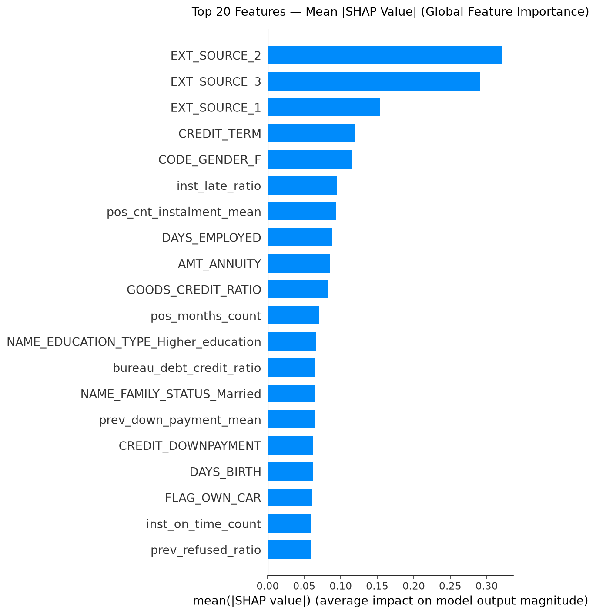
</p>

### Beeswarm

<p align="center">
  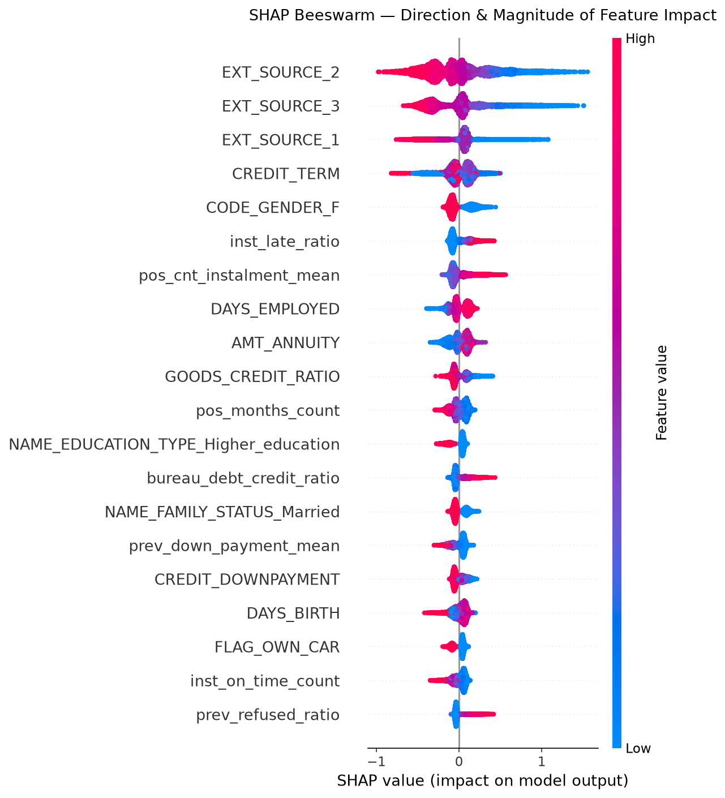
</p>

### Local Explanation

<p align="center">
  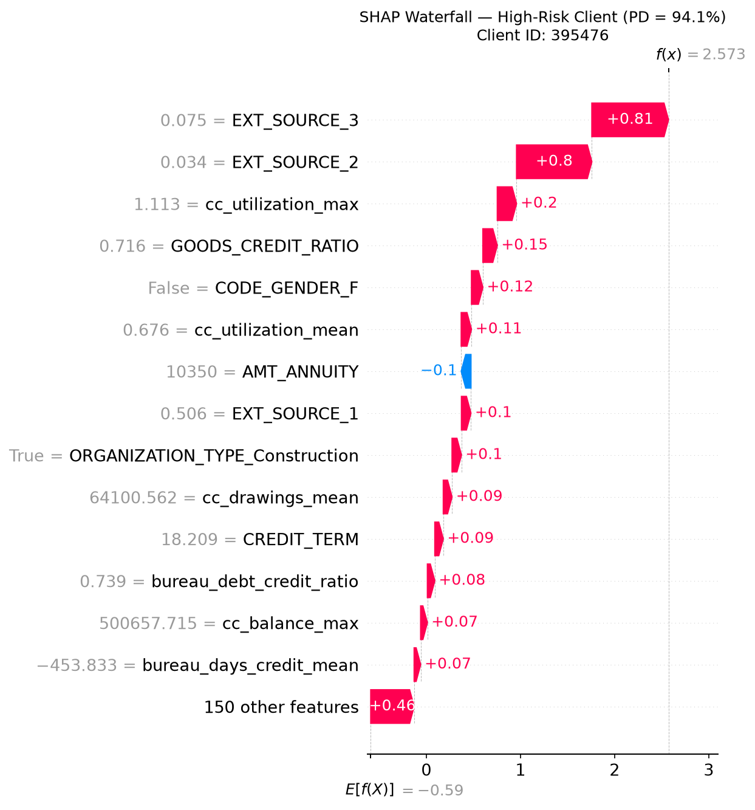
</p>

Ứng dụng thực tế:

| Người dùng | Câu hỏi được trả lời |
|---|---|
| Underwriter | Vì sao hồ sơ này bị gắn high risk? |
| Risk manager | Biến nào đang kéo risk toàn danh mục lên? |
| Auditor | Mô hình có cơ sở giải thích cho quyết định không? |
| Business team | Segment nào nên giảm hạn mức hoặc review thủ công? |

---

## Interactive Dashboard

Dashboard Streamlit được xây dựng cho vai trò Credit Risk Analyst, có filter động và KPI phản hồi theo phân khúc.

### Tab Credit Risk Analyst

| Biểu đồ | Insight |
|---|---|
| Who Defaults by Employment | Nhóm nghề nghiệp nào tạo nhiều default nhất |
| Default by Loan Term | Kỳ hạn nào có rủi ro cao |
| Exposure & Default Rate by Credit Band | Dư nợ và default rate theo dải khoản vay |
| Vintage Analysis | Xu hướng default theo cohort/thời gian |
| PD Distribution | Tập trung rủi ro theo phân phối xác suất vỡ nợ |
| ECL & Default Rate by DTI | ECL tăng theo áp lực nợ trên thu nhập |
| IFRS 9 Staging | Cơ cấu EAD theo Stage 1/2/3 |

### Filter Controls

| Filter | Vai trò |
|---|---|
| Family Status | Phân tích rủi ro theo trạng thái gia đình |
| Region Rating | Theo dõi khác biệt địa lý/vùng |
| Risk Tier | Tập trung vào Very Low/Low/Medium/High |
| Loan Term | So sánh 12/24/36/60+ tháng |

<p align="center">
  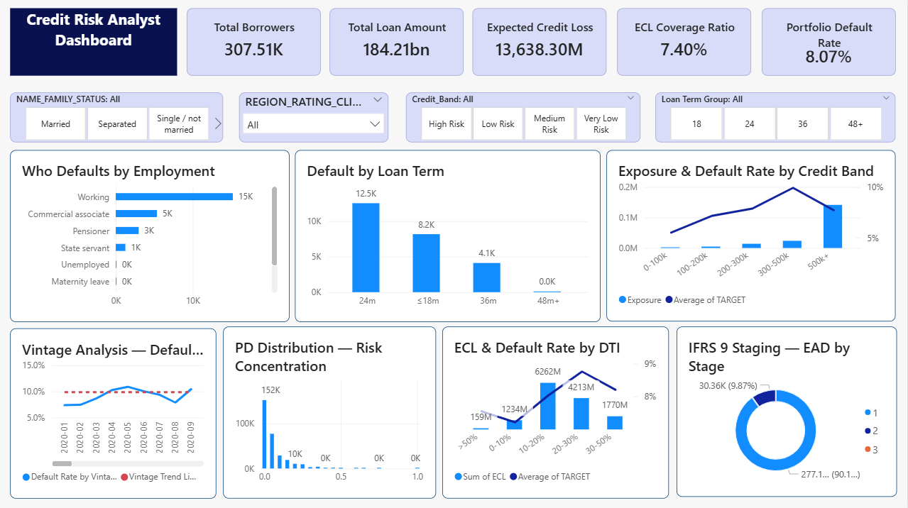
</p>

### Hệ thống Dashboard Tác Nghiệp kiểu Power BI

Phần dashboard tác nghiệp chuyển hóa kết quả pipeline thành giao diện báo cáo cho business user. Nguồn dữ liệu trung tâm là `data/results_df.parquet` / `data/results_ifrs9.parquet`, chứa ID khách hàng, nhãn thực tế, PD đã hiệu chuẩn, risk tier, EAD, LGD, ECL và các feature chính.

| Visual | Mục tiêu phân tích |
|---|---|
| Who Defaults by Employment | Xác định nhóm nghề nghiệp/phân khúc tạo nhiều nợ xấu |
| Default by Loan Term | So sánh rủi ro giữa các kỳ hạn 12/24/36/60+ |
| Exposure & Default Rate by Credit Band | Nhìn đồng thời dư nợ và default rate theo dải khoản vay |
| Vintage Analysis | Theo dõi xu hướng default theo cohort để phát hiện suy giảm chất lượng danh mục |
| PD Distribution | Đánh giá mức tập trung rủi ro toàn danh mục |
| ECL & Default Rate by DTI | Phân tích quan hệ giữa DTI, default rate và ECL |
| IFRS 9 Staging | Theo dõi tỷ trọng Stage 1/2/3 cho risk và finance reporting |

---

## Enterprise Data Warehouse & SQL Use Cases

Hệ thống có `schema_sqlserver.sql` và bộ SQL/report phục vụ khai thác scoring output trong môi trường Data Warehouse. Phần này mô tả cách kết quả mô hình được sử dụng bởi các phòng ban nghiệp vụ.

### 1. Collections Department

**Tình huống:** Chờ khách hàng quá hạn mới xử lý là bị động và tốn chi phí.

**Chiến lược:** Lọc khách hàng có PD cao, Stage 2/3 hoặc sắp đến kỳ thanh toán để nhắc nợ sớm, ưu tiên nguồn lực thu hồi cho nhóm có ECL lớn.

<p align="center">
  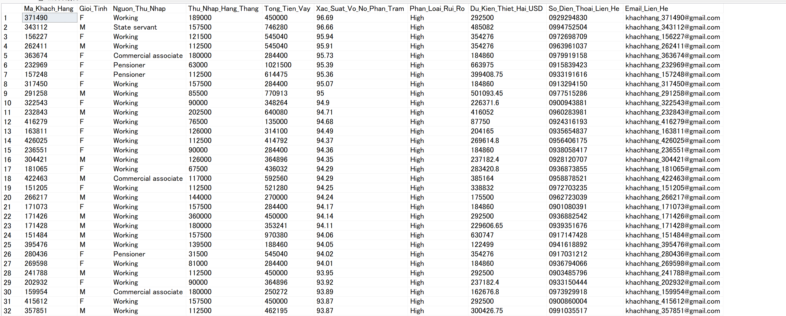
</p>

### 2. Underwriting / Credit Approval

**Tình huống:** Phê duyệt thủ công hàng ngàn hồ sơ gây nghẽn cổ chai.

**Chiến lược:** Auto-approve nhóm Very Low Risk, manual review nhóm Medium Risk, auto-reject hoặc giảm hạn mức nhóm High Risk. Kết hợp SHAP để giải thích lý do từ chối hoặc review.

<p align="center">
  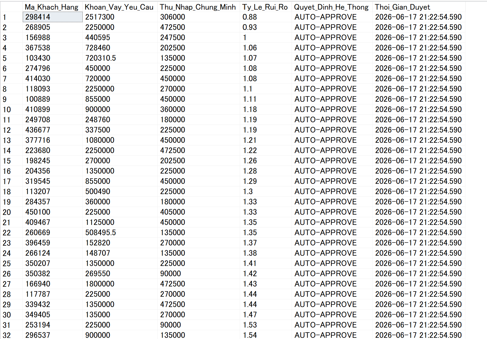
</p>

### 3. Risk Management & Finance

**Tình huống:** Trích lập dự phòng cào bằng có thể giam vốn quá mức hoặc thiếu vốn khi stress.

**Chiến lược:** Báo cáo EAD/ECL theo Stage 1/2/3, stress test macro scenario và chuẩn bị capital/provisioning buffer.

<p align="center">
  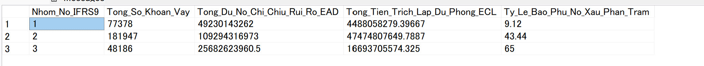
</p>

### 4. Sales & Marketing

**Tình huống:** Marketing đại trà có thể thu hút nhiều khách hàng rủi ro cao.

**Chiến lược:** Xác định khách hàng thu nhập cao, rủi ro thấp để cross-sell/upsell; loại nhóm High Risk khỏi paid audience để giảm chi phí.

<p align="center">
  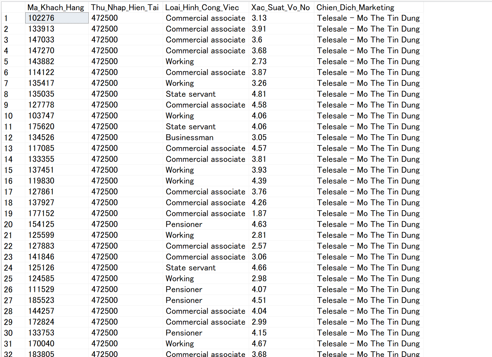
</p>

---

## Tech Stack

| Layer | Technology |
|---|---|
| ML Core | LightGBM, XGBoost, CatBoost, scikit-learn |
| Baseline | Logistic Regression, RandomForest |
| Optimization | Optuna TPE Sampler |
| Calibration | Isotonic Regression |
| Interpretability | SHAP |
| MLOps | MLflow, model artifacts, metrics JSON |
| API | FastAPI, Uvicorn, Pydantic |
| Dashboard | Streamlit, Plotly |
| Data | pandas, numpy, pyarrow/parquet |
| Governance | IFRS 9, Basel II-style WoE/IV, model governance report |
| Database | SQL Server schema and analytical SQL views/use cases |

---

## Cách Chạy Dự Án

### 1. Cài dependencies

```bash
pip install -r requirements.txt
```

### 2. Chạy full pipeline

```bash
python src/data_cleaning.py
python src/feature_engineering.py
python src/woe_iv_scorecard.py
python src/optuna_tuning.py
python src/modeling.py
python src/ifrs9_ecl_engine.py
python src/business_roi_analysis.py
python src/shap_analysis.py
```

### 3. Chạy dashboard

```bash
python -m streamlit run app/streamlit_app.py
```

### 4. Chạy API

```bash
python -m uvicorn app.api:app --host 0.0.0.0 --port 8000 --reload
```

### 5. Chạy test nhanh

```bash
python -m compileall src app tests
python -m unittest discover -s tests -q
```

---

## Cấu Trúc Thư Mục

```text
Enterprise-Credit-Risk-Scoring/
|
|-- app/
|   |-- streamlit_app.py          # Dashboard Streamlit
|   |-- api.py                    # FastAPI scoring API
|
|-- src/
|   |-- data_cleaning.py          # Cleaning và joining raw data
|   |-- feature_engineering.py    # Feature engineering từ 6 bảng
|   |-- woe_iv_scorecard.py       # WoE/IV feature screening
|   |-- optuna_tuning.py          # Bayesian hyperparameter tuning
|   |-- modeling.py               # Multi-model benchmark, CV, calibration
|   |-- lgd_ead_model.py          # LGD/EAD modeling
|   |-- ifrs9_ecl_engine.py       # IFRS 9 staging và ECL
|   |-- business_roi_analysis.py  # ROI threshold optimization
|   |-- shap_analysis.py          # SHAP explainability
|   |-- time_series_engine.py     # Vintage/cohort/scenario analytics
|
|-- models/
|   |-- model_fold1-5.pkl         # Model fold artifacts
|   |-- lgbm_fold1-5.pkl          # Legacy LightGBM fold artifacts
|   |-- best_production_model.pkl # Production model artifact
|   |-- isotonic_calibrator.pkl   # Probability calibrator
|   |-- feature_list.pkl          # Feature order for inference
|   |-- tier_config.json          # Risk tier thresholds
|   |-- model_metrics.json        # Core model metrics
|
|-- reports/
|   |-- model_comparison_leaderboard.csv
|   |-- ifrs9_stage_summary.csv
|   |-- model_governance_doc.md
|   |-- business_insights.md
|   |-- calibration_curve.png
|   |-- model_benchmark_roc.png
|   |-- shap_*.png
|   |-- confusion_matrix_*.png
|
|-- images/
|   |-- streamlit_dashboard.png
|   |-- dashboard.png
|   |-- sql_query_*.png
|
|-- tests/
|   |-- test_core_contracts.py
|
|-- schema_sqlserver.sql
|-- requirements.txt
|-- PROJECT_PLAN.md
|-- README.md
```
